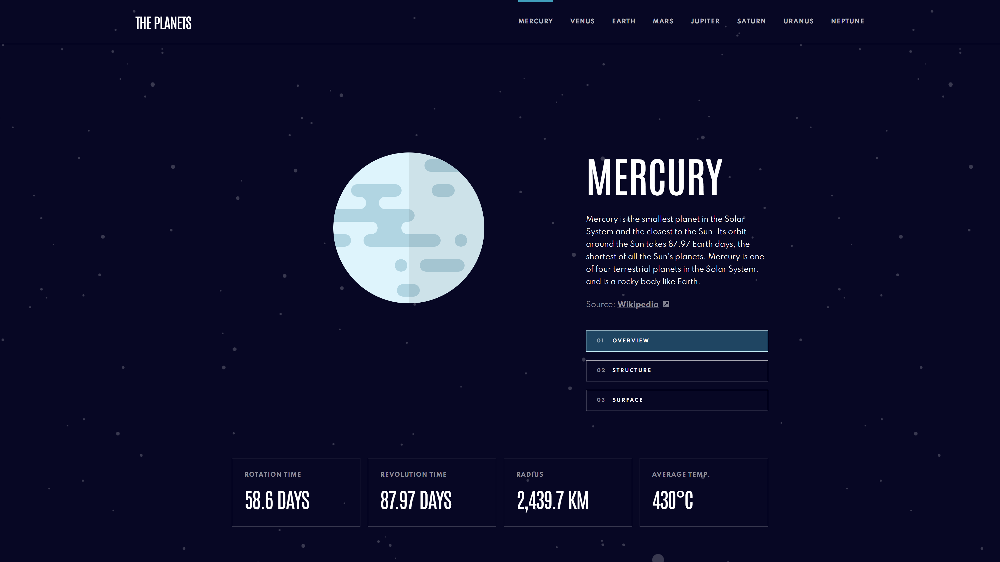

# Frontend Mentor - Planets fact site solution

This is a solution to the [Planets fact site challenge on Frontend Mentor](https://www.frontendmentor.io/challenges/planets-fact-site-gazqN8w_f). Frontend Mentor challenges help you improve your coding skills by building realistic projects.

## Table of contents

- [Overview](#overview)
  - [The challenge](#the-challenge)
  - [Screenshot](#screenshot)
  - [Links](#links)
- [My process](#my-process)
  - [Built with](#built-with)
  - [What I learned](#what-i-learned)
  - [Useful resources](#useful-resources)
- [Author](#author)

**Note: Delete this note and update the table of contents based on what sections you keep.**

## Overview

### The challenge

Users should be able to:

- View the optimal layout for the app depending on their device's screen size
- See hover states for all interactive elements on the page
- View each planet page and toggle between "Overview", "Internal Structure", and "Surface Geology"

### Screenshot

### Links

- [Live Site Preview](https://mieszkokowalik-planets.netlify.app/)

## My process

### Built with

- [React](https://reactjs.org/)
- [React Router](https://reactrouter.com/)
- [Create React App](https://create-react-app.dev/)
- [Styled Components](https://styled-components.com/)
- [Atomic Design](https://atomicdesign.bradfrost.com/chapter-2/)
- Mobile-first workflow
- Semantic HTML5 markup
- Flexbox
- CSS Grid

### What I learned

This is my first project made in React. I tried to keep it preatty simple and just get a grip on basic react concepts.

### Useful resources

- [Netlify redirects](https://docs.netlify.com/routing/redirects/)
- [Codepen - CSS Loading Animations by Alex](https://codepen.io/AlexWarnes/pen/jXYYKL) - I really liked one of these loading animations and decided to use it in this project and tune it a little bit for my needs.

## Author

- Frontend Mentor - [@MieszkoKowalik](https://www.frontendmentor.io/profile/MieszkoKowalik)
